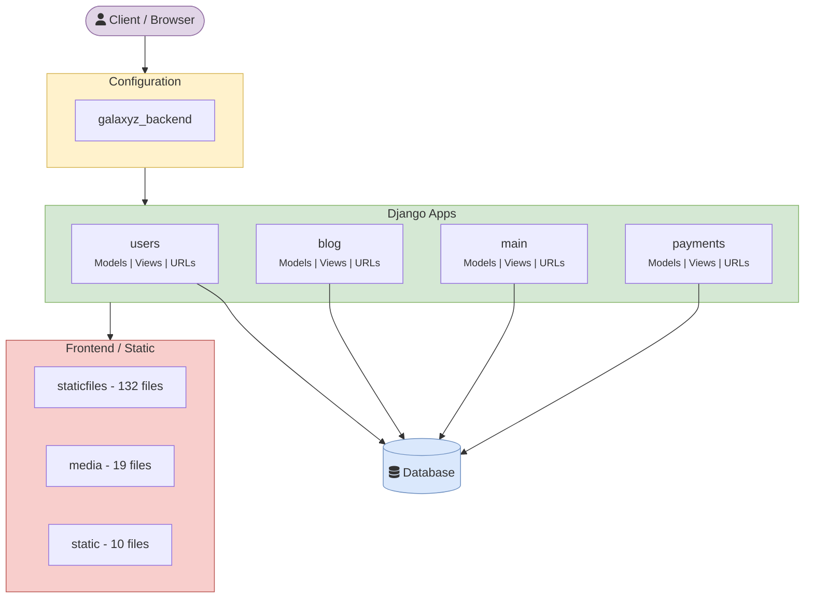
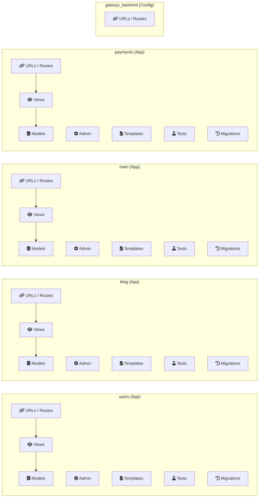
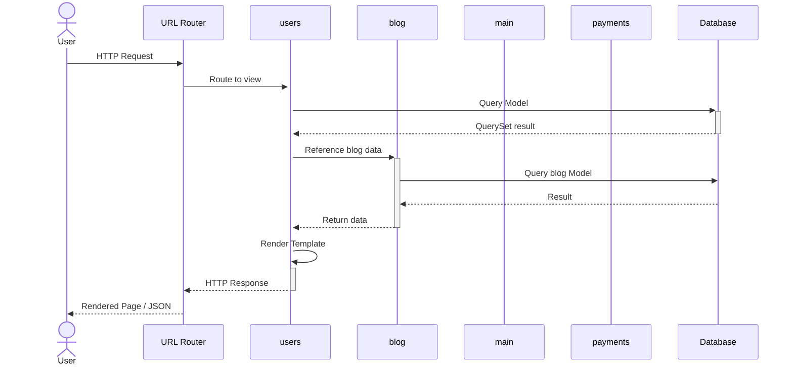

# Galaxyz Space Site

> This repository contains 327 total files: 126 source code, 7 documentation, 0 configuration, and 46 frontend files. The primary language is JavaScript. The codebase is organized into 6 main modules.

[]() []() []()

## Tech Stack

| | |
|---|---|
| **Language** | JavaScript |
| **Framework** | Django |
| **Total Files** | 327 |
| **Modules** | 6 |
| **Source Files** | 0 |
| **Frontend Files** | 0 |
| **Test Files** | 0 |
| **Config Files** | 0 |
| **Documentation** | 0 |

## System Architecture

The following diagram shows the high-level architecture and how modules relate to each other:



## Project Structure

| Module | Description | Size | Key Components |
|--------|-------------|------|----------------|
| **staticfiles/** | Module 'staticfiles' contains 85 source file(s) (.js). Complexity: high. | 85 files |
| **blog/** | Module 'blog' contains 10 source file(s) (.py). Complexity: medium. | 10 files |
| **users/** | Module 'users' contains 9 source file(s) (.py). Complexity: medium. | 9 files |
| **main/** | Module 'main' contains 8 source file(s) (.py). Complexity: medium. | 8 files |
| **payments/** | Module 'payments' contains 8 source file(s) (.py). Complexity: medium. | 8 files |
| **galaxyz_backend/** | Module 'galaxyz_backend' contains 5 source file(s) (.py). Complexity: low. | 5 files |

## Module Internals

Shows the internal components and relationships within each module:



## Request Flow

How a typical request flows through the system:



## Key Insights

- Large codebase with significant engineering investment.
- Documentation is present with 7 doc file(s).
- Frontend layer detected with 46 file(s).

## Dependencies

- `pip packages (see requirements.txt)`

## Getting Started

```bash
pip install -r requirements.txt
python manage.py migrate
python manage.py runserver
```

---

<sub>Auto-generated by [Living Documentation System](https://github.com/Shan713/Living-Documentation-System) on 2026-03-11 09:12 UTC — triggered by commit [`b9d1626`] — Merge branch 'main' of https://github.com/Shan713/galaxyZ-space-site</sub>
